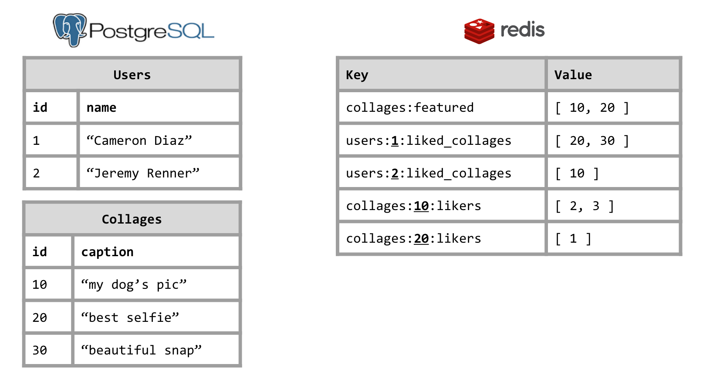

# Ardis

Ardis is a simple library that allows you to leverage the NoSQL [Redis](http://redis.io/) store to index, group, rank or associate traditional `ActiveRecord` objects.
Internally, Ardis *only* stores the `id`s of the `ActiveRecord` objects in Redis data structures, but provides an `ActivRecord` association-like interface.

## Installation

Add this line to your application's Gemfile:

```ruby
gem 'ardis'
```

And then execute:

    $ bundle

Or install it yourself as:

    $ gem install ardis

## Usage

Basic usage is using the DSL to create a class-level collection (i.e. a "Series").

```ruby
require 'ardis'

class Collage < ActiveRecord::Base
  include Ardis
  series_list name: 'featured', global: true
end

c = Collage.create
Collage.featured << c
Collage.featured.first
 => #<Collage id: 1, ... >
```

Or you can create an instance-level Series:

```ruby
class Collage < ActiveRecord::Base
  include Ardis
  series_list name: 'likers', relation: User
end

c = Collage.create
c.likers << User.create(name: 'John Doe')
c.likers << User.create(name: 'Jane Tow')
c.likers.limit(2).to_a
 => [ #<User id: 1, ... >, #<User id: 2, ... > ]
```

Which would result in:



The instance that holds the Series (in the example above `m`) is referred to as the "container".

Of course you can always create it manually:

```ruby
s = Ardis::RedisAdapter::ListSeries.new(key: 'collages:featured', relation: Collage)
s << Collage.create
```

When retrieving objects from a collection, most of the methods familiar from
`ActiveRecord` relations work:

```ruby
m.users.limit(10).offset(2).reverse_order
m.users.page(2)                      # `Kaminari` integration
m.users.includes?(@joe)              # Check if in collection
m.users.includes(:some_association)  # Eager-loading
m.users.count                        # Can be faster, unlike PostgreSQL
m.users.empty?
m.users.delete(@joe)
m.users.where(gender: 'male')        # Will `nil`-out objects that don't match
                                     # (but only remove if `autocompact`, see below).
```

#### Redis keys
If using the DSL, Ardis will choose the appropriate Redis keys based on the Class
name, container and given name, and depending if the Series is `global` or not, but the key
can always be overridden manually:

```ruby
series_sorted_set name: 'mycollection', key: 'custom:redis:key', global: true
```

or calculated on the fly:

```ruby
series_sorted_set name: 'mycollection', key: ->(container){ "mycollection:#{container.id}:somename" }
```


#### Series types
Implementations are provided for the basic [Redis data structures](http://redis.io/topics/data-types):
- [Lists](http://redis.io/topics/data-types-intro#lists)
- [Sets](http://redis.io/topics/data-types-intro#sets)
- [Sorted sets](http://redis.io/topics/data-types-intro#sorted-sets)

#### Inverse Series
Two Series' can be declared inverses of each other in a reciprocal association, so that
inserting into one, automatically inserts into the other one.

For example, suppose we have `User`s that like `Photo`s.

```ruby
class User < ActiveRecord::Base
  series_list name: 'liked_photos', relation: Photo, inverse_of: 'likers'
end

class Photo < ActiveRecord::Base
  series_list name: 'likers', relation: User, inverse_of: 'liked_photos'
end

u = User.create name: 'Jaime'
p = Photo.create caption: 'The beach!'
u.liked_photos << p
p.likers.to_a
 => [ #<User @name='Jaime' ... > ]
```

Internally they are two different Redis lists, but you only have to insert and remove from one of them.

#### Autocompact
If the underlying `ActiveRecord` row is deleted, Ardis will return `nil` for that object.
Running a query with `autocompact` automatically purges that id from the Redis datastructure.

```ruby
s = Ardis::RedisAdapter::ListSeries.new name: 'list', relation: User
s << User.create name: 'Bill'
s << User.create name: 'Clay'
s.to_a
 => [ #<User name: 'Bill'>, #<User name: 'Clay'> ]

User.where(name: 'Bill').destroy_all

s.limit(2).to_a
 => [ nil, #<User name: 'Clay'> ]
s.limit(2).autocompact.to_a
 => [ #<User name: 'Clay'> ]
s.limit(2).to_a
 => [ #<User name: 'Clay'> ]
```

#### Sorted Sets
One of the most useful Redis data structures is the [Sorted Set](http://redis.io/topics/data-types-intro#sorted-sets).
With Ardis, each of the `ActiveRecord` objects (or rather its `id`) associated with a *score*, by which
they are sorted. The score can be configured to be read automatically from an attribute:

```ruby
class User < ActiveRecord::Base
  series_sorted_set global: true, name: :queue_by_age, attr_score: :age
end

@joe = User.create age: 21
User.queue_by_age << @joe
User.queue_by_age.score_for(@joe)
 => 21.0
User.queue_by_age.incr(@joe, 1)
```

The score can also be calculated on the fly and set automatically upon reading
(to avoid extra trips to the database):

```ruby

class User < ActiveRecord::Base
  series_sorted_set global: true, name: :queue_by_bmi, attr_score: :bmi

  attr_writer :bmi
  def bmi
    @bmi ||= weight / (height * height)
  end
end

@bob = User.create height:186, weight:80
User.queue_by_bmi << @bob
users = User.queue_by_age.with_scores.to_a
 => [ #<User @bmi=0.0023 ... > ]
```

#### Advanced usage
(Documentation coming soon)
- `initializer`
- Custom Redis client, for pipelining/multi

## Development

After checking out the repo, run `bin/setup` to install dependencies. Then, run `rake test` to run the tests. You can also run `bin/console` for an interactive prompt that will allow you to experiment.

To install this gem onto your local machine, run `bundle exec rake install`. To release a new version, update the version number in `version.rb`, and then run `bundle exec rake release`, which will create a git tag for the version, push git commits and tags, and push the `.gem` file to [rubygems.org](https://rubygems.org).

## Contributing

Bug reports and pull requests are welcome on GitHub at https://github.com/cardinalblue/ardis.


## License

The gem is available as open source under the terms of the [MIT License](http://opensource.org/licenses/MIT).

